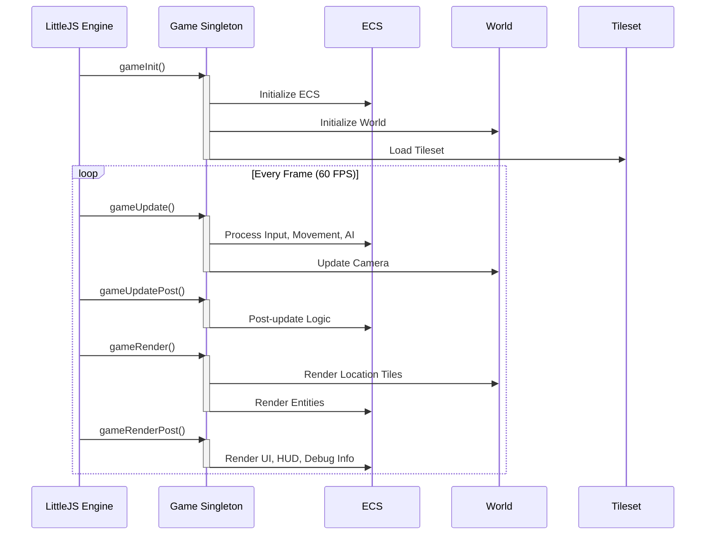

```mermaid
sequenceDiagram
    participant Engine as LittleJS Engine
    participant Game as Game Singleton
    participant ECS as ECS
    participant World as World
    participant Tileset as Tileset

    Engine->>Game: gameInit()
    activate Game
    Game->>ECS: Initialize ECS
    Game->>World: Initialize World
    Game->>Tileset: Load Tileset
    deactivate Game

    loop Every Frame (60 FPS)
        Engine->>Game: gameUpdate()
        activate Game
        Game->>ECS: Process Input, Movement, AI
        Game->>World: Update Camera
        deactivate Game

        Engine->>Game: gameUpdatePost()
        activate Game
        Game->>ECS: Post-update Logic
        deactivate Game

        Engine->>Game: gameRender()
        activate Game
        Game->>World: Render Location Tiles
        Game->>ECS: Render Entities
        deactivate Game

        Engine->>Game: gameRenderPost()
        activate Game
        Game->>ECS: Render UI, HUD, Debug Info
        deactivate Game
    end
```

[//]: # 'This content was generated by AppMap Navie.'
[//]: # 'messageId: 172c0b44-0316-48f4-83e4-be79e0f3c6fa'
[//]: # 'threadId: adf19b20-1cac-4eef-a72c-d1e270f83b53'
