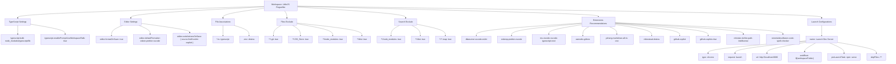

```mermaid
flowchart TD
    A["Workspace: LittleJS Roguelike"] --> B["TypeScript Settings"]
    B --> C["typescript.tsdk: node_modules/typescript/lib"]
    B --> D["typescript.enablePromptUseWorkspaceTsdk: true"]

    A --> E["Editor Settings"]
    E --> F["editor.formatOnSave: true"]
    E --> G["editor.defaultFormatter: esben.prettier-vscode"]
    E --> H["editor.codeActionsOnSave: { source.fixAll.eslint: explicit }"]

    A --> I["File Associations"]
    I --> J["*.ts: typescript"]
    I --> K[".env: dotenv"]

    A --> L["Files Exclude"]
    L --> M["**/.git: true"]
    L --> N["**/.DS_Store: true"]
    L --> O["**/node_modules: true"]
    L --> P["**/dist: true"]

    A --> Q["Search Exclude"]
    Q --> R["**/node_modules: true"]
    Q --> S["**/dist: true"]
    Q --> T["**/*.map: true"]

    A --> U["Extensions Recommendations"]
    U --> V["dbaeumer.vscode-eslint"]
    U --> W["esbenp.prettier-vscode"]
    U --> X["ms-vscode.vscode-typescript-next"]
    U --> Y["eamodio.gitlens"]
    U --> Z["yzhang.markdown-all-in-one"]
    U --> AA["mikestead.dotenv"]
    U --> AB["github.copilot"]
    U --> AC["github.copilot-chat"]
    U --> AD["christian-kohler.path-intellisense"]
    U --> AE["streetsidesoftware.code-spell-checker"]

    A --> AF["Launch Configurations"]
    AF --> AG["name: Launch Dev Server"]
    AG --> AH["type: chrome"]
    AG --> AI["request: launch"]
    AG --> AJ["url: http://localhost:8080"]
    AG --> AK["webRoot: ${workspaceFolder}"]
    AG --> AL["preLaunchTask: npm: serve"]
    AG --> AM["skipFiles: <node_internals>/**"]
```

[//]: # 'This content was generated by AppMap Navie.'
[//]: # 'messageId: 1844fd0c-1231-40a3-a987-9c94de6a3864'
[//]: # 'threadId: adf19b20-1cac-4eef-a72c-d1e270f83b53'
